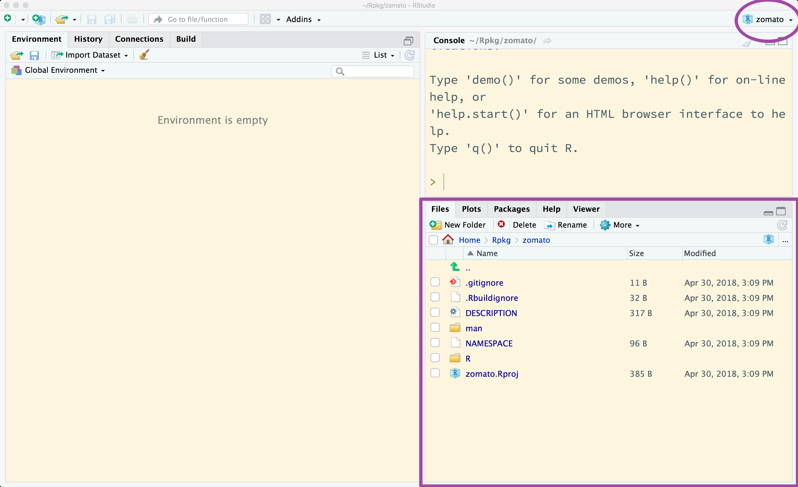

```{r initial, echo = FALSE, cache = FALSE, results = 'hide'}
library(knitr)
options(htmltools.dir.version = FALSE, tibble.width = 80, tibble.print_min = 6)
opts_chunk$set(
  echo = TRUE, warning = FALSE, message = FALSE, comment = "#>",
  fig.path = 'figure/', cache.path = 'cache/', fig.align = 'center', 
  fig.width = 12, fig.height = 11, fig.show = 'hold', 
  cache = TRUE, dev = 'svglite'
)
```

## Step 0: catchy package name

`available::available()` to make sure that the package name is unique and valid. `r emo::ji("crossed_fingers")`

```{r}
available::available("zomato", browse = FALSE)
```

---

## Step 1: package skeleton

`usethis::create_package()` to initialise the basics of the package

```r
usethis::create_package("~/Rpkg/zomato")
```

```
#> Changing active project to zomato
#> ✔ Creating 'R/'
#> ✔ Creating 'man/'
#> ✔ Writing 'DESCRIPTION'
#> ✔ Writing 'NAMESPACE'
#> ✔ Writing 'zomato.Rproj'
#> ✔ Adding '.Rproj.user' to './.gitignore'
#> ✔ Adding '^zomato\\.Rproj$', '^\\.Rproj\\.user$' to '.Rbuildignore'
#> ✔ Opening project in RStudio
```

---



---

## Step 2: edit `DESCRIPTION`

```
Package: zomato
Version: 0.0.0.9000
Title: What the Package Does (One Line, Title Case)
Description: What the package does (one paragraph).
Authors@R: person("First", "Last", email = "first.last@example.com", role = c("aut", "cre"))
License: What license is it under?
Encoding: UTF-8
LazyData: true
ByteCompile: true
```

---

## Step 3: write R functions

```r
usethis::use_r(name = "api")
```

```r
● Modify 'api.R'
```

---

## Step 4: use functions from other packages

```r
usethis::use_package("httr")
```

```
#> ✔ Adding 'httr' to Imports field in DESCRIPTION
#> ● Refer to functions with `httr::fun()`
```

---

## Step 5: document your functions

* Shortcut `command` + `option` + `shift` + `R` to insert roxygen skeleton

* Shortcut `command` + `shift` + `D` to generate man file (`*.Rd`)

---

## Step 6: unit tests

```r
usethis::use_test("api")
```

```
#> ✔ Adding 'testthat' to Suggests field in DESCRIPTION
#> ✔ Creating 'tests/testthat/'
#> ✔ Writing 'tests/testthat.R'
#> ✔ Writing 'tests/testthat/test-api.R'
#> ● Modify 'test-api.R'
```

---

## Step 6: unit tests

<blockquote class="twitter-tweet" data-lang="en"><p lang="en" dir="ltr">Sometime I self-soothe by writing unit tests.<br>This is how the world should be and … it is.<br>This is how the world should be and … it is.<br>This is how … WTF!?! OK, fixed.<br>This is how the world should be and … it is.</p>&mdash; Jenny Bryan (@JennyBryan) <a href="https://twitter.com/JennyBryan/status/983096934209482752?ref_src=twsrc%5Etfw">April 8, 2018</a></blockquote> <script async src="https://platform.twitter.com/widgets.js" charset="utf-8"></script> 

---

## Step 7: go to public

make a website and tweet about it

```r
devtools::install_github("r-lib/pkgdown")
```

```r
pkgdown::build_site()
```

---

## Step 8: submit to CRAN

```r
devtools::submit_cran()
```

---

class: inverse middle center

### Made with `r icon::fa("heart")`

--

### Slides created via xaringan `r emo::ji("crossed_swords")` <http://slides.earo.me/rladies-pkg>

--
### Open source <https://github.com/earowang/rladies-pkg>

--
### This work is under licensed [`r icon::fa("creative-commons")` BY-NC 4.0](https://creativecommons.org/licenses/by-nc/4.0/).

--

### Thank you!
