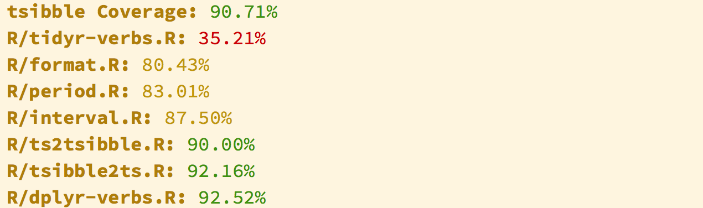

```{r initial, echo = FALSE, cache = FALSE, results = 'hide'}
library(knitr)
options(htmltools.dir.version = FALSE, tibble.width = 80, tibble.print_min = 6)
opts_chunk$set(
  echo = TRUE, warning = FALSE, message = FALSE, comment = "#>",
  fig.path = 'figure/', cache.path = 'cache/', fig.align = 'center', 
  fig.width = 12, fig.height = 11, fig.show = 'hold', 
  cache = TRUE, dev = 'svglite'
)
```

class: center middle inverse

This page has been intentionally left blank.

---

## Why R package?

---

## Tools to automate the package development

* RStudio

* `available`: Check if the Title of a Package is Available, Appropriate and Interesting

* `usethis`: Automate Package and Project Setup

* `devtools`: Tools to Make Developing R Packages Easier

* `testthat`: Unit Testing for R

* `pkgdown`: Make Static HTML Documentation for a Package

---

class: center middle inverse

# Today's mission

## `r icon::fa_square()` Create an `r icon::fa_r_project()` package to query the Zomato API

---

## Step 0: come up with a catchy `r emo::ji("package")` name

* Unique & googlable

* Describes what the package does (for example, **knitr** is neater than Sweave)

* Only contains letters, numbers, and dots

* Begins with a letter, and not end with a period

--

### Good practices

* Avoid capitalisation for less memorisation and less typing

---

## Step 0: come up with a catchy `r emo::ji("package")` name

--

`available::available()` makes sure that the package name is valid and unique.

--

```r
available::available("romato", browse = FALSE)
```

```
#> ── romato ─────────────────────────────────────────────────────────────────
#> Name valid: ✔
#> Available on CRAN: ✔ 
#> Available on Bioconductor: ✔
#> Available on GitHub:  ✖ 
#> Bad Words: ✔
#> Abbreviations: http://www.abbreviations.com/romato
#> Wikipedia: https://en.wikipedia.org/wiki/romato
#> Wiktionary: https://en.wiktionary.org/wiki/romato
#> Urban Dictionary:
#>   Not found.
#> Sentiment:???
```

---

## Step 1: setup `r emo::ji("package")`

--

`usethis::create_package()` initialises the basic components of a package.

--

```r
usethis::create_package("~/Rpkg/romato")
```

```
#> Changing active project to romato
#> ✔ Creating 'R/'
#> ✔ Creating 'man/'
#> ✔ Writing 'DESCRIPTION'
#> ✔ Writing 'NAMESPACE'
#> ✔ Writing 'romato.Rproj'
#> ✔ Adding '.Rproj.user' to './.gitignore'
#> ✔ Adding '^romato\\.Rproj$', '^\\.Rproj\\.user$' to '.Rbuildignore'
#> ✔ Opening project in RStudio
```

* `R/`: the R code

* `man/`: the documentation

* `DESCRIPTION`: the metadata of the package

* `NAMESPACE`: how the package interacts with R and with other packages (do not edit by hand)

---

## Step 1: setup `r emo::ji("package")`


---

## Step 2: edit `DESCRIPTION`

```
Package: romato
Version: 0.0.0.9000
Title: What the Package Does (One Line, Title Case)
Description: What the package does (one paragraph).
Authors@R: person("First", "Last", email = "first.last@example.com", role = c("aut", "cre"))
License: What license is it under?
Encoding: UTF-8
LazyData: true
ByteCompile: true
```

--

### Version numbering convention

* major.minor.patch.dev: `0.0.0.9000`

---

## Step 3: choose a license

* MIT License `use_mit_license()`: free for anyone to do anything with.

* GPLv3 `use_gpl3_license()`: changes and bundles must also be GPL.

* CC0 `use_cc0_license()`: dedicated to public domain, best for data packages.

--

```r
usethis::use_mit_license("Earo Wang")
```

```
✔ Setting License field in DESCRIPTION to 'MIT + file LICENSE'
✔ Writing 'LICENSE.md'
✔ Adding '^LICENSE\\.md$' to '.Rbuildignore'
✔ Writing 'LICENSE'
```

.footnote[more on license: [choose a license](https://choosealicense.com)]

---

## Step 4: `r emo::ji("package")`-oriented functions

We are going to write some Zomato API wrappers. 

```r
usethis::use_r(name = "zomato-api")
```

```r
● Modify 'zomato-api.R'
```

* An API key is needed, which you can sign up [here](https://developers.zomato.com/api).

* Check out [the documentation](https://developers.zomato.com/documentation) for developers.

---

## Non `r emo::ji("package")`-oriented functions in a script

```r
library(httr)
library(jsonlite)
zomato_search <- function(api_key = NULL, query) {
  # URL to Zomato API
  url <- modify_url(
    url = "https://developers.zomato.com" , 
    path = "/api/v2.1/search"
  )
  # request URL
  resp <- GET(
    url = url, 
    config = add_headers("user-key" = api_key),
    query = list(q = query)
  )
  # read the JSON file
  parsed <- fromJSON(
    content(
      resp, as = "text", type = "application/json", encoding = "UTF-8"
    ),
    flatten = TRUE
  )
  # return results
  parsed$restaurants
}

ur_key <- "your-api-key"
zomato_search(ur_key, query = "Brother Budan Baba Melbourne")
```

---

## Step 4: `r emo::ji("package")`-oriented functions

In the `R/` folder of a package:

* `r emo::ji("no_entry_sign")` `library()` or `require()`: dependencies are managed in the `NAMESPACE` file.

* `r emo::ji("no_entry_sign")` `source()`

* `r emo::ji("no_entry_sign")` `options()` or `par()`

* `r emo::ji("no_entry_sign")` `setwd()`

---

class: middle

Click [me](https://gist.github.com/earowang/e027a3f5ceac9f91ef8307415d02e0f5) to download the pre-prepared R scripts.

---

## Step 5: use `r emo::ji("package")``::fun()`

```r
usethis::use_package("httr")
```

```
#> ✔ Adding 'httr' to Imports field in DESCRIPTION
#> ● Refer to functions with `httr::fun()`
```

```r
usethis::use_package("jsonlite")
```

```
#> ✔ Adding 'jsonlite' to Imports field in DESCRIPTION
#> ● Refer to functions with `jsonlite::fun()`
```

---

## Step 6: explore in console `r icon::fa_arrows_alt_h()` write R code

Imodifyn RStudio, `Cmd/Ctrl` + `Shift` + `L` loads all the functions into the environment.

```r
devtools::load_all(".")
#> Loading romato
```

---

## Step 7: document

* Enable markdown support in roxygen

```r
usethis::use_roxygen_md()
```

```
#> ✔ Setting Roxygen field in DESCRIPTION to 'list(markdown = TRUE)'
#> ✔ Setting RoxygenNote field in DESCRIPTION to '6.0.1'
#> ● Re-document
```

---

## Step 7: document

* `Cmd/Ctrl` + `Opt/Alt` + `Shift` + `R` inserts roxygen skeleton

```r
#' Title
#'
#' @param api_key 
#' @param query 
#'
#' @return
#' @export
#'
#' @examples
zomato_search <- function(api_key = NULL, query) {
  ...
}
```

--

Each roxygen comment is preceded by `#'`.

* `@param`: inputs of the function, followed by a description
* `@return`: what the function returns
* `@export`: make the function visible/accessible to users
* `@exmaples`: examples of how to use the function

To know the list of parameters: `browseVignettes("roxygen2")`.

---

## Step 7: document

* `Cmd/Ctrl` + `Shift` + `D` to generate `/man` files (`*.Rd`)

```
==> devtools::document(roclets=c('rd', 'collate', 'namespace'))

Updating romato documentation
Loading romato
Writing NAMESPACE
Documentation completed
```

`?zomato_search` to preview the man page

---

## Step 8: install package

* `Cmd/Ctrl` + `Shift` + `B` to build the package

```
==> R CMD INSTALL --no-multiarch --with-keep.source romato

* installing to library ‘/Library/Frameworks/R.framework/Versions/3.5/Resources/library’
* installing *source* package ‘romato’ ...
** R
** byte-compile and prepare package for lazy loading
** help
*** installing help indices
** building package indices
** testing if installed package can be loaded
* DONE (romato)
```

---

## Step 9: R CMD check

* `Cmd/Ctrl` + `Shift` + `E` to perform R CMD check

```
Status: OK


R CMD check results
0 errors | 0 warnings | 0 notes

R CMD check succeeded
```

---

class: center middle inverse

# Good practices
### - Build a package that sustains

---

## Unit tests

Catch bugs before they happen, and guarantee the validity of the code.

--

```r
usethis::use_test("api")
```

```
#> ✔ Adding 'testthat' to Suggests field in DESCRIPTION
#> ✔ Creating 'tests/testthat/'
#> ✔ Writing 'tests/testthat.R'
#> ✔ Writing 'tests/testthat/test-api.R'
#> ● Modify 'test-api.R'
```

--

For example in the `test-api.R`

```r
context("Zomato API")

test_that("invalid input", {
  expect_error(zomato_search(api_key = NULL), "Please provide an API key.")
})
```

* `Cmd/Ctrl` + `Shift` + `T` to perform tests

---

## Unit tests

<br>
<br>
<br>
<br>

<blockquote class="twitter-tweet" data-lang="en"><p lang="en" dir="ltr">Sometime I self-soothe by writing unit tests.<br>This is how the world should be and … it is.<br>This is how the world should be and … it is.<br>This is how … WTF!?! OK, fixed.<br>This is how the world should be and … it is.</p>&mdash; Jenny Bryan (@JennyBryan) <a href="https://twitter.com/JennyBryan/status/983096934209482752?ref_src=twsrc%5Etfw">April 8, 2018</a></blockquote> <script async src="https://platform.twitter.com/widgets.js" charset="utf-8"></script> 

---

## Code coverage

Code coverage is the % of code that is covered by unit tests.

```r
covr::package_coverage()
```



`covr::report()` displays covr results in a standalone report.


---

## README

```r
usethis::use_readme_rmd()
```

```
✔ Writing 'README.Rmd'
✔ Adding '^README\\.Rmd$' to '.Rbuildignore'
● Modify 'README.Rmd'
```

--

A README file should include:

* A brief overview of the package

* instructions on how to install

* A few examples

---

## Vignette

```r
usethis::use_vignette("intro-romato")
```

```
#> ✔ Adding 'knitr' to Suggests field in DESCRIPTION
#> ✔ Setting VignetteBuilder field in DESCRIPTION to 'knitr'
#> ✔ Adding 'rmarkdown' to Suggests field in DESCRIPTION
#> ✔ Creating 'vignettes/'
#> ✔ Adding '*.html', '*.R' to 'vignettes/.gitignore'
#> ✔ Adding 'inst/doc' to './.gitignore'
#> ✔ Creating 'vignettes/intro-romato.Rmd'
#> ● Modify 'intro-romato.Rmd'
```

--

Rmarkdown + metadata

```
---
title: "Vignette Title"
author: "Vignette Author"
date: "`r Sys.Date()`"
output: rmarkdown::html_vignette
vignette: >
  %\VignetteIndexEntry{Vignette Title}
  %\VignetteEngine{knitr::rmarkdown}
  %\VignetteEncoding{UTF-8}
---
```

---

## Website

```r
pkgdown::build_site()
```

---

## Release

```r
devtools::release()
```

---

## Useful resources

* ["Building a package that lasts" --- eRum 2018 workshop by Colin Fay](https://github.com/ColinFay/erum2018)
* [Prepare for CRAN](https://github.com/ThinkR-open/prepare-for-cran)

---

class: inverse middle center

### Made with `r icon::fa("heart")`

--

### Slides created via xaringan `r emo::ji("crossed_swords")` <http://slides.earo.me/rladies-pkg>

--
### Open source <https://github.com/earowang/rladies-pkg>

--
### This work is under licensed [`r icon::fa("creative-commons")` BY-NC 4.0](https://creativecommons.org/licenses/by-nc/4.0/).

--

### Thank you!
